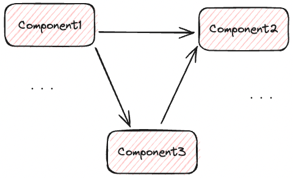
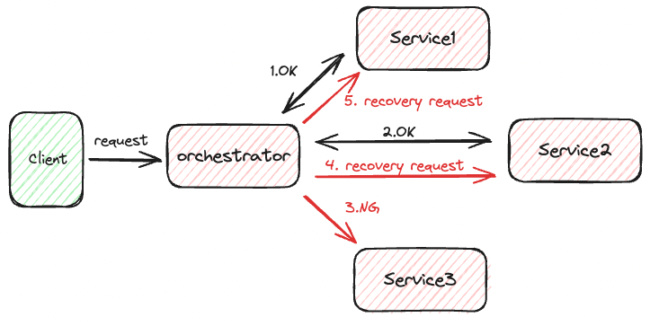
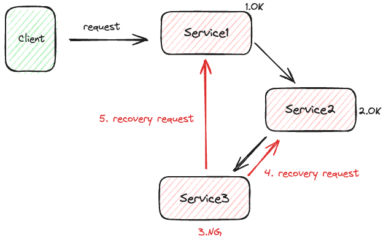

# アーキテクチャ

## システムがサポートしなければならない要素（アーキテクチャ要件）

- 可用性
- 信頼性/安全性
- テスト容易性
- スケーラビリティ
- セキュリティ
- アジリティ
- 耐障害性(継続性)
- 弾力性
- 回復性
- パフォーマンス
- デプロイ容易性
- 学習容易性

アーキテクトはトレードオフを考えながらビジネスにマッチするように上記を満たす構成を考えなければならない。  
つまりアーキテクトの仕事は成功のためのビジネスドライバーを理解し、それらの要件を各アーキテクチャ要件へと変換すること。

### アーキテクチャの運用特性

- 可用性
  - システムがどのくらいの期間利用できるか？（24時間365日など）
- 信頼性/安全性
  - システムがフェイルセーフか
  - 人命に影響を与えるようなミッションクリティカルであるか
- スケーラビリティ
  - ユーザー数やリクエスト数が増えてもシステム動作を維持できるか
- 耐障害性(継続性)
  - 障害時にどれだけシステムを維持できるか
- 回復性
  - 処理の持続要件
  - 災害時にシステムをどれだけ早くオンラインに戻せるか
- 堅牢性
  - 実行中にインターネット接続が切れた、停電、ハードウェア障害時などにエラーや境界条件を処理できるか

### アーキテクチャの構造特性

- 構成容易性
  - エンドユーザーがソフトウェアを簡単に設定できるか
- インストール容易性
  - 必要なすべてのプラットフォームへのインストールの容易さ
- 活用性/再利用性
  - 複数の製品で共通のコンポーネントを利用できるか
- ローカライゼーション
  - マルチバイト文字の要件、単位や通過などの多言語に対応しているか
- メンテナンス容易性
  - 変更の適用やシステムの拡張がどれだけ簡単に行えるか
- 可搬性
  - 複数のプラットフォームで動作できるか（例えば別OSやDBでも動作するか）
- アップグレード容易性
  - 旧バージョンから新バージョンへのアップグレードを簡単/迅速に行うことができるか

### アーキテクチャの横断的特性

- アクセシビリティ
  - 色覚障害や難聴などの障害を持つユーザーを含め、全てのユーザーのアクセスのしやすさ
- 長期保存
  - データをどの程度保持しておく必要があるか
    - アカウントを３ヶ月後に削除する
    - アカウントは廃止されたものとしてアーカイブする
- 認証
  - ユーザーが何者かを確認するためのセキュリティ要件
- 認可
  - ユーザーが一定のルールに基づいて特定の機能のみにアクセス制限できるか
- 合法性
  - システムがどのような法的制約の中で運用されるか
    - データ保護
    - 米企業改革法
    - GDPR
  - アプリケーションの構築方法やデプロイ方法に関する規制はあるか
    - ライセンス違反していないか
- プライバシー
  - 従業員から取引を隠せるか
    - 取引データの暗号化など
- セキュリティ
  - データベース内でデータを暗号化する必要があるか
  - 社内システム間のネットワーク通信を暗号化する必要があるか
  - リモートユーザーのアクセスにはどのような認証が必要か
- サポート容易性
  - どの程度の技術サポートが必要か
  - ログによってエラー解析等が行えるようになっているか
- ユーザビリティ/達成容易性
  - ユーザーが目標を達成できるためにどの程度の訓練が必要か

## アーキテクトの役割

- アーキテクチャ決定を下す
- アーキテクチャを継続的に分析する
- 最新のトレンドを把握し続ける
- 決定の順守を徹底する
- 多様なものに触れ、経験している
- 事業ドメインの知識を持っている
- 対人スキルを持っている
- 政治を理解し、かじ取りする

### アーキテクチャ決定を下す

技術的な選択をするのではなく、ガイドを行うことが重要。  

例えばフロントエンドに「react」を使用すると決定するのではなく、「フロントエンドのWeb開発にリアクティブベースのフレームワークを使う」ということを開発チームに指示する。  

技術的な決定は開発チームと共に行う。  
（もちろん可用性等の問題でアーキテクトが決定しなければならない場合もある）

### アーキテクチャを継続的に分析する

今日時点でのビジネス、技術面からアーキテクチャを評価できる必要がある。  
これができない場合、ビジネス構造的な崩壊を起こしている可能性が高い。  
技術や問題領域の変化を全体的に分析し、アーキテクチャの戦前性を把握すること。

### 最新のトレンドを把握し続ける

アーキテクトの決定は長時間に及ぶ影響を与えると共に変更が難しい。  
日常で使用している技術を常に追いかけ続ける必要がある。

### 決定の順守を徹底する

決定されたアーキテクチャや設計指針に対して開発チームが従っている火を常に検証すること。

### 多様なものに触れ、経験している

さまざまなシステムやサービスとやりとりする方法を、それらがどんな言語やプラットフォーム、技術を使っているかに関係なく、わかっている必要がある。

技術的な深さよりも幅を重視して知識を身につけること。

1種類のキャッシュソフトウェアの専門家であることよりも、10種類のキャッシュソフトウェアそれぞれの長所と短所をよく押さえていることの方が、はるかに価値がある。

### 事業ドメインの知識を持っている

ステークホルダやビジネスユーザとうまくコミュニケーションがとれる程度にビジネス知識を持っておく必要がある。

### 対人スキルを持っている

優れた技術者であったとしても、チームリードや開発者の指導、アイデアや決定されたアーキテクチャ、設計指針をうまく伝えられないと意味がない。

### 政治を理解し、かじ取りする

開発者が技芸の範囲で行う決定と比べて、アーキテクトが行う決定は広範で重要な決定となることが多いため、正当性を示すために戦う必要が出てくる。

### 実現するアーキテクチャ特性をどのように選択するか

全てのアーキテクチャ特性を実現しようとすると開発前の段階で既にかなりの複雑度となり開発が困難となる可能性が高い。  
一般的には優先度をつけたいところだが、全てのステークホルダとの不要な摩擦を生む可能性が高い。  
そのため、順位をつけずに重要なもの上位３つを選択してもらう方が良い。

### 要件からアーキテクチャ要件を抽出する

1. 推定ユーザー数に注目（スケーラビリティ）
2. 弾力性（スパイクアクセスに対応する力）が必要か

## Monolith

全ての機能が１アプリケーションに集約される伝統的なアプローチ

- メリット
  - 小規模なチームやアプリケーション開発に向く
  - デプロイが簡単
  - 機能同士のネットワークレイテンシがないため、パフォーマンスがよい
- デメリット
  - 新しいテクノロジーを採用することが困難
    - 新しいフレームワークや技術を使用してアプリケーションを強化するなど
    - 新技術を導入する際は基本的にコードベース全体を更新する必要がある=古い技術を使い続けなければならない
  - 特定の機能のみのスケールが困難
  - 可能性の問題
  - 小さな変更でも全体の再デプロイが必要

アプリケーションが成長した場合、以下の問題が発生する可能性が高い

- アプリケーションの複雑度が日々高まり、全体を理解できる人がいない
- 少しの影響が大部分への影響となるため、修正に対して非常に神経を使う
- 新技術の導入が困難
- 少しの修正であっても全体をデプロイする必要がある
- 一つのミスで全体がクラッシュする
- リグレッションテストなどに多くのコストが必要

## MicroServices

UIとは別に各サービス層をそれぞれ分割されたコンテナにデプロイするパターン

- メリット
  - サービス単位の開発、テスト、デプロイが容易
  - サービス間が完全に疎結合になる
    - 各チームがそれぞれの方法で進めることが可能
  - 特定のサービスだけをスケールさせることが可能
- デメリット
  - デプロイの複雑化
  - コンテナやサービスを複数起動する必要があるため、インフラのオーバーヘッドの懸念がある
  - ネットワーク経由でサービス間の呼び出しが行われるため、セキュリティの懸念がある

## MicroServicesの境界をどのように設定するか？

- DomeinDrivenによるサイジング
  - そのアプリケーションに対するドメイン（ビジネス）境界をもってサイジングを行う
    - 銀行アプリケーションであれば以下のようなイメージ
      - アカウント
      - カード
      - ローン
  - 各ドメインに対して専門的な知識を有する人（ドメインエキスパート）およびビジネス関係者、技術者、クライアント関係者から情報を得た上で行うべき
    - 各ドメインの業務
    - チームの規模
    - 既存アプリケーション情報
- イベントストーミングサイジング(<https://www.lucidchart.com/blog/ddd-event-storming>)
  - 以下の手順を踏む
    - 適切な人を招待する
      - テスター
      - マネージャ
      - アーキテクト
      - ビジネスリーダー
    - アプリケーション内で発生するイベントを全て質問する
      - 重複したものについてはファシリテータが削除すればOK
    - ビジネスドメインを探索する
      - 各ドメインのイベント（プロセスまたはシステム内で起きること）を特定する
        - 常に過去形であることを確認する（未来のことは追加改修で対応）
      - イベントの原因と結果を特定する
        - イベントトリガー（例えば以下）
          - ユーザー
          - 他のイベントから発生
          - 外部システム
        - イベントの反応
          - イベントの結果として何が起こるか
            - 例えば以下
              - アカウントが作成される
              - アカウント作成後にメールが送信される
    - 各イベントをグループ化（境界コンテキスト）する
      - 同様の機能を多数保持するものはグループ可する

## 12 & 15 Factors & Beyond

Heroku Cloud Platformのエンジニアチームによって定められたクラウドネイティブアプリケーション構築における12のガイドライン。  
後に上記に加えて3つの原則を追加した15のガイドラインが現在では広く使われている。
「Beyond the Twelve-Factor App」

- One codebase, one application`
  - 1つのマイクロサービスアプリケーションが1つのコード（Git Repository）を保持すること
    - 1つのコードベースに対して「開発」「ステージング」「本番」が用意される
    - ただし、多くのアプリケーションで共有するコードについてはまた別の1コードベースとして管理される（つまりスタンドアロンサービスのようなイメージで使われる）
  - 禁止
    - 1アプリケーションが複数のコードベースから構成される
- API first
  - アプリケーションのすべての機能要件は可能な限りAPIの使用（組み合わせ）を通じて満たされるべき
    - つまりアプリケーションにおける最も重要な成果物はAPIという考え方
    - Webやモバイルは単なるAPIのコンシューマとして捉え、APIを先に設計する
- Dependency management
  - アプリケーションの依存するモジュールは自身で管理せず、依存性管理ツールを使用すること
    - JavaならMaven, Gradle
    - C#ならNuget
  - マイクロサービスの数が増えると手動でセットアップは現実的ではないため
- Design, build, release, run
  - 全てのステージが完全に分離されていること
  - 上記に対するCI/CDを構築すること
  - Design
    - 後続のステップで必要なテクノロジー、依存関係、ツールを全て決定する
    - 全て決定後、設計、開発、テストを行う
    - 完了後buildステージに進む
  - Build
    - 必要な全ての依存関係を含むコードベースをコンパイルしてパッケージ化する
    - 全てのビルドに一意なアーティファクトIDが振られる
    - CIによって生成されることが推奨される
    - 完了後Releaseステージに進む
  - Release
    - コードベースパッケージとデプロイメント構成を組み合わせる
    - 全てのコードベースアーティファクトを保存する（特定の地点へ戻れるように）
    - 完了後Runステージに進む
  - Run
    - 指定された環境でアプリケーションを実行する
    - CDによって行われることが推奨される
- Configration, credentials & code
  - 環境によって異なる値（アプリケーション設定や構成など）はコードから切り離されていること
    - WebサービスやSMTPサーバーなどのURL
    - データベース接続情報
    - APIへの認証情報
    - プロパティファイル、構成XML
  - 基本的に環境によって変更される可能性がある全ての構成はビジネスロジック内に持ち込まれないようにする
    - 外部で保守できるように構成する
    - 結果、アプリケーションの内部はビルド後に不変なものとなる
  - 基本は環境変数によって機密情報が提供されること
  - コードベースをそのままオープンソース化して問題ないかを考えること
- Logs
  - 全てのログは時間とともに流れるイベントストリームと考えること
  - アプリケーションから見てログの保管場所を気にしないこと
    - ログは標準出力へ出力する
  - ログの集約、処理、保管、分析はログアグリゲータに移譲する
    - ELKスタック（ElasticSearch、Logstash、Kibana）
    - Splunk
    - Sumologic
- Disposability
  - アプリケーションを素早く起動、停止することができること
    - これにより、システムの堅牢性と回復性を確保する
    - 停止はもちろんハードシャットダウンではなくグレースフルなシャットダウン
  - アプリケーションが応答しなくなった場合、終了して置き換えることが可能であること
    - 高負荷時にkubernetesなどのプラットフォームによって新しいインスタンスが自動的に作成される
  - 起動時に発生するキャッシングやフェッチの処理についてはバッキングサービスに外部化してフロントロード不要とすること
- Baking Service
  - アプリケーションが依存するサービス
    - データストア（DB, S3など）
    - メッセージングシステム（Kafkaなど）
    - キャッシュ（Redisなど）
    - メール（SESなど）
    - 基盤業務機能
    - セキュリティ実行サービス（OAuth2など）
  - これらは全て
  - 外部サービスは全て抽象化された状態でアクセスが行われること
- Environment Parity
  - アプリケーションがどのような環境でも動作するように構成されていること
    - 本番では動かないが、QA環境では動くといった事態を避ける
  - 一般的には以下に注意すること
    - Time
      - 開発者がコードチェックインしてから本番環境に到達するまでに数週間、数ヶ月かかるといったことがないようにする
        - どのような変更が行われたのかを忘れる
      - CI/CDといったパイプラインによって自動化を行い、継続的にデプロイメントされることを目指す
        - これによって環境が常に同じであるように見えるようになる
    - People
      - デプロイメントは人の手によって行われるべきではなく、１ボタンや特定のイベントに反応してデプロイされるべき
        - ローカル環境については自由
    - Resource
      - 開発を行う環境は全て本番環境相当のサービスを導入すること
        - 本番環境ではPostgreSQLを使用するのにローカル環境ではH2を使用するといったことが無いようにする
        - 導入、設定が困難であるサービスについてはDockerなどを使用して簡単に構築可能とすること
- Alternative Processes
  - アプリケーションをサポートするために必要な以下のような管理タスクは一つのパッケージとしてまとめられる必要がある
    - データ移行
    - データクリーンアップ
    - データ更新バッチジョブ
  - Cronやタイムスケジューラで起動されるようなものはマイクロサービスでは弊害を引き起こす可能性が高い
  - これらの管理タスクはアプリケーションのビジネスロジックに組み込むのではなく、独立したマイクロサービスとして構築することを考慮する
  - 他には上記のようなジョブに関しては起動するためのスイッチをRESTAPIに用意するといった方法もある
- Port binding
  - 1つのコンテナ上で複数のアプリを起動しないこと
  - 外部プロバイダからのポート接続によってアプリに接続できること
    - つまりコード変更せずに外部から接続可能であること
  - アプリケーションには内部のサーバ（Tomcatなど）に依存するようなコードを記載しないこと
    - 依存するようなコードを記述すると手動で管理する必要が出てくるため
- Stateless processes
  - アプリケーション内には基本的にステータスを保持しないこと
    - 長期的に保持するステータスがある場合はバッキングサービスにてステータスを保持すること
      - RDB
      - MongoDB
      - Redis
  - アプリケーション内にステータスを保持する=アプリケーション内にキャッシュするということなのでDisposabilityの面からも反する構成となる
  - アプリ内キャッシュを使用してしまうとスケールすることによってさらに多くのメモリを使用することになってしまう
- Concurrency
  - スケールアップではなく、スケールアウトを使用すること
    - スケールアップ
      - 限界点への到達が早い
      - 負荷分散が使えない
    - スケールアウト
      - 限界点無し
  - リクエストを同時処理させる必要がある
- Telemetry
  - クラウドアプリケーションの監視は主に以下の3つに対して行われる
    - アプリケーションパフォーマンス監視（APM）
    - ドメイン固有のテレメトリ
    - ヘルスログとシステムログ
  - これらのテレメトリの情報は一つのコンポーネントに対して集約されること
  - アプリケーションパフォーマンス監視（APM）
    - クラウドの外部ツールで監視する
    - パフォーマンス定義は開発者、管理者によって決められる
    - 複数アプリケーションから取得されることもある
    - 例えばアプリケーションが処理している1秒あたりの平均HTTPリクエスト数など
  - ドメイン固有のテレメトリ
    - ビジネス上で意味のあるイベントとデータを収集する
    - 多くの場合、保管、分析、予測のためにビッグデータシステムに渡される
    - 例えば過去20分間にiPadを使用しているユーザーに販売されたウィジェットの数など
  - ヘルスログとシステムログ
    - クラウドプロバイダーによって提供される
    - 例えばアプリケーションの起動、シャットダウン、スケーリング、Webリクエストのトレース、ヘルスチェックなど
  - 監視の設計をする場合には以下を考慮する必要がある
    - 情報が入ってくる速度
    - どれだけの情報をどの期間保存するか
    - 1インスタンスから100インスタンスにスケールされた場合に問題ないかなど
- Authentication and authorization
  - セキュリティに関する事項は全てのアプリケーションに対して重要な部分であるため、優先的に取り組むこと
    - 全てのリクエストでは以下が明確である必要がある
      - 誰がそのリクエストを送信しているか
      - 利用者がどのロールに属しているか
  - 理想的には全てロールベースのアクセス制御にて保護すること

## モノリスからマイクロサービスへどのように移行するか？

モノリスの場合、内部コンポーネントの依存度が高くなっていることが多く、マイクロサービスの抽出にコストが大きくかかることが多い、
そのためコードを抽出するのではなく、削除していく方法を第一に検討する。

- モノリスのサービスをフォークする
- フォークされたモノリスから不要な部分を削除し、リファクタリングを行う

フォークしたサービスに対して以下を行う。

1. コンポーネント（機能）の抽出
2. ドメイン共通コンポーネントの抽出
3. コンポーネントのフラット化
4. コンポーネントの依存関係の判断
5. コンポーネントドメインの作成
6. ドメインサービスの作成
7. マイクロサービス化

### コンポーネント（機能）の抽出

アプリケーション内での一貫性のある識別子（機能やドメインと言ってもいいかもしれない）
ものによっては名前空間で判断可能。
例えば以下のようなイメージ。

- ログイン
- 請求・支払い
- 請求履歴
- 顧客通知

一つのコンポーネントが他と比べて大きすぎる場合は、サブ機能、サブドメインに分割する。
（ただし、無理に分割する必要はなく、分割できない場合はそのままでOK）

### ドメイン共通コンポーネントの抽出

以下のようなもの。
Utilityと呼ばれるイメージ。

- 各通知やリクエストの共通処理
- データフォーマット
- バリデーション
- メール送信

これらは基盤機能（ログ、メトリクスの収集、セキュリティのような運用的側面を持つもの）とは明確に区別される。  
基盤機能はドメイン共通コンポーネントには含まれない。

ドメイン共通コンポーネントについては共通サービス化（もしくは共通ライブラリ化）を行う。
ただし、共通ライブラリについては毎回それぞれの依存元サービスに配布する必要があるためCI/CDで配布するなどの工夫が必要。

### コンポーネントのフラット化

以下のような名前空間を保持する場合を考える。

```text
sample.history          履歴コンポーネント
sample.history.template 履歴テンプレートコンポーネント
```

上記のようにある名前空間の中で使用されているコンポーネントが分割（拡張）されている場合  
コンポーネントをサービス化する際に全てを履歴コンポーネントとすべきか、別々のサービスとすべきかを判断する必要がある。

このような状態に対応するためにソースコードをフラット化し  
ルートとなる名前空間、もしくはリーフノードの名前空間に全てのソースコードを移動させるように修正する（つまりフラット化する）。

#### リーフノードのコンポーネントをルートコンポーネントにフラット化した場合

```text
sample.history          履歴コンポーネント(履歴テンプレートコンポーネントのコードを含む)
```

この場合はリーフノードが完全に存在しない状態となっている。

#### 完全にリーフノードのコンポーネントにフラット化した場合

```text
sample.history.template 履歴テンプレートコンポーネント
sample.history.create   履歴作成コンポーネント（sample.historyから新規に切り出す）
sample.history.process  履歴プロセスコンポーネント（sample.historyから新規に切り出す）
```

この場合は「sample.history」名前空間にはコードがない状態となっている（つまりリーフノードに全てのコードが集められている）。

#### コンポーネント間の共通コードが存在するパターン

```text
sample.history          共通コンポーネント
sample.history.template 履歴テンプレートコンポーネント
sample.history.create   履歴作成コンポーネント（sample.historyから新規に切り出す）
sample.history.process  履歴プロセスコンポーネント（sample.historyから新規に切り出す）
```

この場合は下記のようにルート名前空間から共通コンポーネントへと切り出す。

```text
sample.history.shared   共通コンポーネント
sample.history.template 履歴テンプレートコンポーネント
sample.history.create   履歴作成コンポーネント（sample.historyから新規に切り出す）
sample.history.process  履歴プロセスコンポーネント（sample.historyから新規に切り出す）
```

### コンポーネントの依存関係の判断

コンポーネント間の依存関係を調査し、以下の問いに対する回答を導き出す。



- アプリケーションは分解可能か？
  - はい
  - いいえ
- 移行にかかる全体的な労力はどれくらいか？
  - 小
  - 中
  - 大
- 必要になるのはコードの書き換えか？それともリファクタリングか？
  - リファクタリング
  - リファクタリングと既存コードの書き換え
  - アプリケーションの全面的な書き換え

### コンポーネントドメインの作成

コンポーネントを論理的にグループ化し、アプリケーションを分割する際に、より粗い粒度のドメインサービスを作成可能にする。

モノリシックアプリケーションの分解では、その足がかりとして、まずサービスベースアーキテクチャへの移行を検討する。

#### 名前空間のリファクタリング

一般的に名前空間は以下で表現する。

例）
ss.customer.billing.payment.MonthlyBilling

- ss
  - アプリケーション
- customer
  - ドメイン
- billing
  - サブドメイン
- payment
  - コンポーネント
- MonthlyBilling
  - クラス名

上記のうち、customerのコンポーネントであるものの  
名前空間にcustomerが表現されていないものについては名前リファクタリングを行い  
customerの名前空間内に含まれるように修正する。

顧客の請求履歴コンポーネントが「ss.billing.history」のようになっている場合は  
「ss.customer.billing.history」となるように修正する。

### ドメインサービスの作成

各コンポーネントのサイジング、フラット化、グループ化が完了すると  
それぞれを完全に切り離して別々のサービスとしてデプロイできるようになる。

## トランザクションの扱い

マイクロサービスにおいては複数DBとなるため各DB間のトランザクションが困難となる。
トランザクションパターンは基本的に以下のサーガと呼ばれるパターンのうち、どれかを選択することとなる。  
それぞれでトレードオフがあるため、適切に選択する必要がある。

- エピックサーガ
- 伝言ゲームサーガ
- おとぎ話サーガ
- 時間旅行サーガ
- ファンタジーサーガ
- ホラーストーリーサーガ
- パラレルサーガ
- アンソロジーサーガ

### エピックサーガ

サーガパターンの中では最も一般的なもの。
以下のような特徴を持つ。

- 目的
  - モノリシックな動作を可能な限り目指す
- 通信
  - 同期型
- 整合性
  - アトミック
- 調整方法
  - オーケストレーション

基本的には補償トランザクションを実行する。

- 補償トランザクション
  - 分散トランザクションの内部で他サービスが行ったアクションを逆転させる
    - 更新に対して取り消し処理を行う
    - 削除された行の再挿入
    - 挿入された行の削除

- メリット
  - モノリシックシステムのトランザクション模倣が可能
  - オーケストレータによる明確なワークフロー
- デメリット
  - 全てのトランザクションが完了したかどうかを同期的に待機するためボトルネックとなる可能性がある
  - 要件によっては障害モードに耐えられない可能性がある



### 伝言ゲームサーガ

エピックサーガをコレオグラフィに変更したもの。  
以下のような特徴を持つ。

- 目的
  - モノリシックな動作を可能な限り目指す
- 通信
  - 同期型
- 整合性
  - アトミック
- 調整方法
  - コレオグラフィ

- メリット
  - エラーが発生しない前提であればエピックサーガよりもスループットは高い
  - エピックサーガよりはスケールしやすい
- デメリット
  - 各サービスの複雑度が上昇する
  - サービス間の結合度が上がる
  - オーケストレータがいないため、リカバリーがボトルネックになりうる

伝言ゲームサーガでは最初にリクエストを受けたサービスから別サービスを順に呼び出す。  
呼び出し先で処理が失敗した場合は以前に呼び出されたサービス全てに補償リクエストを送信する。



### おとぎ話サーガ

以下のような特徴を持つ。

- 目的
  - アトミックではなく結果整合性をとるため、要件が緩和される
    - 適用できるシステムの幅が広くなる
  - サービス一時停止などの場合でもサービス復旧まで変更をキャッシュすることも可能
- 通信
  - 同期型
- 整合性
  - 結果整合性
- 調整方法
  - オーケストレーション

エピックサーガとは異なり、オーケストレータはトランザクションを管理しなくなる。  
ドランザクションは各マイクロサービスのドメインサービスが担当する。  

- メリット
  - オーケストレータによる各サービスの管理が容易となる
  - 他の多くのサーガパターンとしてバランスに優れている
- デメリット
  - 全てのトランザクションが完了したかどうかを同期的に待機するためボトルネックとなる可能性がある
  - 要件によっては障害モードに耐えられない可能性がある

### 時間旅行サーガ

### ファンタジーサーガ

### ホラーストーリーサーガ

### パラレルサーガ

### アンソロジーサーガ


### Liveness & Readiness Probe

通常マイクロサービスはKubernetesのような基盤を用いて管理される。  
Kubernetesでは「Liveness Probe」および「Readiness Probe」の設定を行う必要がある。
簡単に言うと、コンテナの稼働性（Liveness Probe）と準備性（Readiness Probe）をチェックする機構。

#### Liveness Probe

コンテナの稼働性（生存）をチェックする。  
ロードバランサーのヘルスチェック機構のようなもの。  
異常な場合はコンテナの再起動もしくは再作成が行われる。

#### Readiness Probe

コンテナの準備性（トラフィック受け入れ可否）をチェックする。  
異常な場合（起動中、リクエスト処理中で応答できないなど）はロードバランスから外される。


