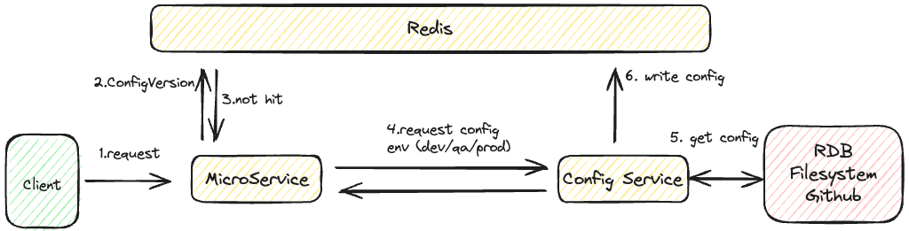

# RESTAPIプログラムアーキテクチャの考慮事項

RESTAPIを組む際のプログラムアーキテクチャを組む場合は以下を考慮すること。

## URL設計

- URL
  - host名の後に「api」を付与
  - 「api」の後にバージョン「v1」などを付与
  - 操作対象のリソースをURLとすること
    - 例えば「`https://localhost/api/v1/account`」など

## CRUDの実装

要件に応じてだが、CRUDの全ての操作が可能であるかを確認すること

## HTTPメソッド

リソースに対する操作で適切にHTTPメソッドを分けること

- GET
  - 取得
    - 成功
      - HTTPStatusCode:200 OK
    - 失敗
      - HTTPStatusCode:404 Not Found
- POST
  - 作成
    - 成功
      - HTTPStatusCode:201 Created
    - 失敗
      - HTTPStatusCode:400 Bad Request
- PUT
  - 更新
    - 成功
      - HTTPStatusCode:201 Created
    - 失敗
      - HTTPStatusCode:400 Bad Request
      - HTTPStatusCode:404 Not Found
- DELETE
  - 削除
    - 成功
      - HTTPStatusCode:200 OK
    - 失敗
      - HTTPStatusCode:400 Bad Request
      - HTTPStatusCode:404 Not Found
- PATCH
  - 一部更新

## レイヤー分け

Controller-Service-Repository
※場合によってはさらに深く分ける必要あり

## トランザクション境界

どこからどこまでがトランザクションで管理すべきかを考慮する

## ORマッパー

ObjectとDataBaseの関連付け。
言語によって適切なライブラリが存在しない場合は自作する。

## グローバル例外ハンドラ

どのレイヤーでも処理されなかった例外を処理する。
一般的には「500 Internal Server Error」で返却する。

## バリデーション

どのレイヤーで入力チェックを行うかを考慮する。

## アプリケーションログ

アプリケーションから発生するログを記録する。

## 監査ログの自動化

レコード作成日時や更新日時を自動化できる仕組みがないかを検討する。

## Documentation

クラスやメソッドへのドキュメンテーション方式を検討する。
publicメソッド
privateメソッド
公開ドキュメント(openapi)（swaggerなどをコードから生成する）

## DIライブラリ

Dependency Injectionを行うためのライブラリ。

## テストフレームワーク

UnitTestを記載するためのフレームワーク。

## アプリケーション設定の外部化

各種設定情報をアプリケーション外部に設定する。

## 環境によるアプリケーション設定ファイルの切り替え

フレームワークによって環境変数を駆使する。  
ただし単純に環境変数を駆使するだけでは以下のような問題が懸念される。  

- 設定項目が膨大になったりした場合に制御不可となる
  - 設定のリビジョン管理や監査が困難
- 保守性が低い
- 環境変数は他のユーザーによって読み取られる可能性がある
- 設定ファイル単体ではパスワードのような暗号化が必要なものに対応できない

別途設定取得用のマイクロサービスを用意することが推奨される。  
MicroService側には以下の環境変数のみを保持しておく。

- configのバージョン
- 環境情報（dev / qa / prod）

本パターンを使用することにより、MicroServiceの再起動なしでアプリケーション設定を更新できる。  
また、その他には以下のようなパターンもある。

- RabbitMQやKafkaのようなメッセージブローカーを使用して各サービスに配信する
- Config Serverに構成プロパティを更新するAPI「/refresh」を用意しておく。
  - Github Webhookのようなトリガーで「/refresh」を起動する