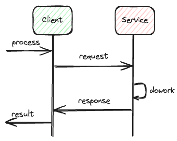
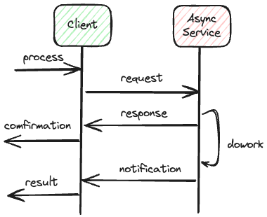
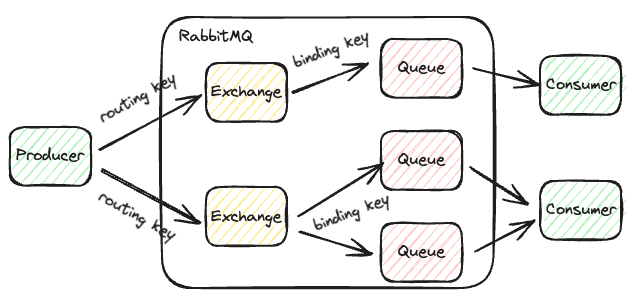

# RabbitMQ

高度なメッセージをサポートするために実装されたオープンソースのメッセージブローカー。  

## 類似する製品

- IBM MQ
- Amazon MQ/Kinesis
- Kafka
- Apache ActiveMQ
- Tibco EMS/Messaging/Rendezvous
- Alibaba Message Queue

中でも人気があるのはRabittMQ, Kafka, Kinesisあたり。

## 類似製品の比較

|| RabbitMQ | Kafka | AWS Kinesis |
| ---- | ---- | ---- | ---- |
| リリース | 2007/06 | 2011/01 | 2013/11 |
| 用途 | メッセージブローカー(queue) | メッセージバス(ストリーム/ログ処理) - log | メッセージバス(ストリーム/ログ処理) |
| リプレイ | 不可 | 可能 | 可能 |
| コンシューマ | メッセージを受信する | 自分からメッセージをpullする | 双方をサポート |
| スループット | High- | Highest | High+ |
| 信頼性 | Highest | High- | High+ |
| 永続期間 | 制限なし | 制限なし | 最大7日 |
| メンテナンスの手間 | High- | Highest | Very Low |
| コスト | Small | Normal | Highest |
| オープンソース | Yes | Yes | No |
| メッセージ処理 | Queueに複数接続できるが配信されるのは１つのみ | 複数のConsumerに配布される | - |
| 可用性 | High | High(但し、クラスターを構築する場合はzookeeperが必要) | - |
| パフォーマンス | High | Very High | - |
| プロトコル | AMQP,STOMP,HTTP,MQTT | binary serialized data | - |
| ストレージ種別 | queue | log | - |
| ストレージ種別 | queue | log | - |

## Queue

### 理解しておくべきこと

http通信処理は基本的に同期通信で実現される。  
上記とは異なり、Queueを使用した処理では非同期通信を実現することが可能。　　
（非同期処理の選択肢にQueueを持っておく必要がある）

同期通信  


非同期通信  


Queueの全体感としては以下が重要。  

### 重要な要素

- Queue size
  - Queue内のメッセージ数
- Quere age
  - Queue内の最も古いメッセージの経過時間

### 役割

- 非同期処理を行うことが可能
  - あるメッセージに対して処理が行われている間は他のプロセスが同一メッセージに対して処理を行うことを防ぐことが可能
- Queueの状況によりシステムをスケールさせることが可能
  - size, ageの状況によってQueueを処理するアプリケーションをスケールさせる判断ができる
- システム中断が可能（信頼性）
  - Queueを処理するアプリケーションが落ちたとしても、再起動後にその時点から再処理が可能となる

### ユースケース

- 複数システムを依存しない形で接続することが可能
  - つまりシステム間のインターフェースのような役割として扱うことが可能
- システムパフォーマンスを測定可能
  - Queueから出力をモニタリングすることでシステムのしきい値に近づいているかを確認可能
- フォールトトレランスレベルを上げることが可能
  - システム障害時でも続けてサービス続行できる機構を作ることが可能
- スケールアウト、自動スケールをサポートする
  - 同じQueueを処理するプロセスを追加/削除することで処理の高速化/コスト最適化を行うことが可能
  - スパイクアクセス等への対応
- システムの受信トラフィックを増加させることが可能
  - 非同期処理
  - fire-and-forgetシナリオ対応
    - メッセージを蓄積して、システムが独自の速度で消費できるようにすることが可能
- ビデオストリーミングデータ、通知データなどに使用可能

## Dockerを用いてRabbitMQを起動する

以下のDockerfileを使用する。

```Dockerfile
FROM rabbitmq:3.13.0-management

# if use conf file
# COPY rabbitmq.conf /etc/rabbitmq
# RUN cat /etc/rabbitmq/rabbitmq.conf

# install with management console plugin
RUN rabbitmq-plugins enable --offline rabbitmq_mqtt rabbitmq_federation_management rabbitmq_stomp
```

## 接続に対するstate

現在の接続に対するstateはmanagementプラグインでインストールしたUI上から確認できる。

- Runnning
  - 対象の接続がアクティブであり、データが流れていることを示す
- Flow
  - 対象の接続はアクティブだが、データが調整中であることを示す
    - RabbitMQにはDDoS攻撃などでデータ送信が早すぎると判断された場合に対処するため、対意図的にスロットリングを起こす機構が実装されている
- Idle
  - 接続は開いているが、メッセージ送信を行なっていない
- Blocking / Blocked
  - 接続に対するデータ送信が停止された状態
    - 接続が多すぎるデータを送信しようとしているが別の接続に送信された場合など
    - アプリケーションによってこの状態を処理できる
      - メッセージ送信を停止したり、再試行ロジックを実行したりできる

## 接続とチャネルの違い

- 接続
  - クライアントとブローカー間のTCP/IP接続
- チャネル
  - 接続内で保持できる複数の仮想接続

TCP/IP接続は基本的に時間がかかる処理のため  
一度接続しておき、オンデマンドでチャネルを開いて通信を行う。

## Exchange

基本的な構造は

1. ProducerがQueueにメッセージを格納
2. 格納されたメッセージをConsumerが使用

となっているが、詳細はProducerとQueueの間にExchangeを挟む構造となっており  
実際にはExchangeがQueueにデータを格納する。  

### ルーティングキーとバインディングキー

ProducerとExchangeの紐付けをルーティングキー  
ExchangeとQueueの紐付けをバインディングキーで行う。

ルーティングキーとバインディングキーは文字列データであり  
Producerが指定したルーティングキーと同名のバインディングキーを保持するQueueにメッセージは格納される。  
ルーティングキーと同名のバインディングキーがない場合  
Producerはエラーを受け取る。  
（メッセージ配布方式による）



### メッセージの配布方式

Exchangeのタイプによってメッセージの配布方式が決まる。

- nameless(default)
- fanout
- direct
- topic
- headers

#### nameless

RabbitMQ独自の配布方式であり、デフォルトとなっている。  
ルーティングキーと同名のキューにメッセージを格納する。  
つまりデフォルトのExchangeを使用するとProducerはメッセージが直接送信されているように感じる。

#### fanout

受信したメッセージをすべてのQueueに書き込む。  
ルーティングキーは無視される。

#### direct

受信したメッセージをルーティングキーと一致するQueueにルーティングする。

#### topic

ルーティングキーに一致するパターンを保持するバインディングキーのQueueに対してルーティングされる。

例）

- ルーティングキー: "application1.Logs.error"
- バインディングキー: "*.Logs.error"

#### headers

topicと似ているが、ヘッダ情報「x-match」の内容によってルーティングが決められる。

## 重要なプロパティ

- Name
  - 適切な命名規約を使用して名称を付与すること
    - 「test1」のようなものは避ける
- Durable or not
  - Durableでない場合は再起動するとデータが消える
- Auto Delete feature
  - 全てのコンシューマーがQueueから切断されるとQueueが自動的に削除される
    - QAテストやパフォーマンステストなどで活用できる
- Classic or Quorum
  - QuorumはRabbitMQの標準であり、高可用性を備えている
  - Classicで可用性を持たせたい場合は特別なミラーリングポリシーを適用する必要がある
- Exclusive
  - 排他Queueは１つの接続でのみ使用され、切断されるとQueueが自動的に削除される
- Priority
  - デフォルトではFIFOだが、優先度によるメッセージの並べ替えを有効にすることができる
- Expiration time(TTL)
  - 格納されてからメッセージを自動削除するまでの時間を設定可能

### Priorityについて

前述の通りデフォルトではFIFOとなっておりメッセージ格納は順序が保証されるが、メッセージの消費については保証されないことに注意すること。